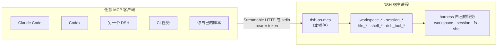

<p align="center">
  
</p>

<h1 align="center">dsh-as-mcp</h1>

<p align="center"><a href="README.md">English</a> | 中文</p>

<p align="center">
  <a href="https://github.com/xiseliuli/dsh-as-mcp/actions/workflows/ci.yml"></a>
  <a href="https://github.com/xiseliuli/dsh-as-mcp/releases"></a>
  <a href="LICENSE"></a>
  <a href="https://www.typescriptlang.org/"></a>
  <a href="https://nodejs.org/"></a>
  <a href="https://modelcontextprotocol.io/"></a>
  <a href="https://github.com/topics/dsh-plugin"></a>
</p>

把一个正在运行的 **DeepSeek Harness** 暴露成 **MCP 服务**，让别的 agent —— Claude Code、
Codex、另一个 DSH、CI 任务、你自己写的脚本 —— 都能驱动它：创建工作区、新建会话、把编码
任务交给 DSH 的 agent、读写文件、执行命令。

端点跑在 DSH 宿主进程**内部**，所以通过 MCP 建出来的会话就是真正的 DSH 会话：它实时出现
在 DSH 界面里，跑在 DSH 沙箱中，受和你手敲一样的那套权限策略约束。agent 本身没有任何东西
是被重新实现的。

## 工作原理



---

## 安装

三种渠道都能把这个 bundle 装进 profile，按你拿到包的方式选一种。

**从 npm：**

```bash
dsh plugin --profile <名称> add dsh-as-mcp
```

从源码 checkout 里跑，等价命令是 `pnpm dsh plugin --profile <名称> add dsh-as-mcp`。

**从 GitHub：**

```bash
dsh plugin --profile <名称> add github:xiseliuli/dsh-as-mcp
```

git 安装拉下来的是源码，不是构建产物 `lib/`，所以 pnpm 得跑本包的 `prepare` 脚本
（`tsdown && node scripts/build-client.mjs`）才能把它建出来。pnpm ≥10 默认拒绝执行这个脚本——
连带它依赖的 `esbuild` 的 postinstall 也一并拦下——直到 profile 显式放行，所以第一次 `add` 会以
`ERR_PNPM_GIT_DEP_PREPARE_NOT_ALLOWED` 失败。

`allowBuilds` 里写裸包名，对 `esbuild`（来自 registry）有效，但对这里的 `dsh-as-mcp` 永远无效：
pnpm 只认 git 依赖精确解析出来的那个 key，不认包名
（[pnpm 文档](https://pnpm.io/settings/build#allowbuilds)）。失败的那次 `add` 会在报错里打印这个
精确 key；把它原样抄进 profile 的 `pnpm-workspace.yaml`（`~/.dsh/profiles/<名称>/pnpm-workspace.yaml`），
再重新跑一次 `add`。不要指望 pnpm 已经替你写好占位项——这条失败路径下它不会写。结果长这样：

```yaml
allowBuilds:
  '<pnpm 写出来的那个精确 git spec，含 commit hash>': true
  esbuild: true
```

这个放行等于允许在你机器上、在安装阶段执行这个包的代码——建议钉死到某个 commit
（`github:xiseliuli/dsh-as-mcp#<sha>`），免得后续的 push 悄悄改掉实际跑的代码。`dsh plugin add` 使用的是
DSH 锁定的 pnpm 版本（DSH 0.1.7-rc.2 为 v11.7.0，输出末尾会打印 `using pnpm v…`），所以下面这条要等
DSH 自带更新的 pnpm 后才适用。如果 profile 用的 pnpm
≥11.19.0（若是克隆而非 `github:` 这种 tarball 形式的 git 依赖，则 ≥11.11.0 即可），可以改为放行整个
仓库——`'dsh-as-mcp@git+https://github.com/xiseliuli/dsh-as-mcp.git': true`，不带 `#<sha>`——这样同一个仓库
之后再提交新 commit 也不用重新放行；更早的 pnpm 版本只能用精确 commit 的 key，每次更新都要重新放行一次
（[pnpm 11.11 release notes](https://pnpm.io/blog/releases/11.11-11.14)，
[pnpm/pnpm#12367](https://github.com/pnpm/pnpm/issues/12367)）。

**从 tarball：**

```bash
pnpm pack
dsh plugin --profile <名称> add /绝对路径/dsh-as-mcp-<版本>.tgz
```

用**同一个** tarball 路径重装会悄悄沿用旧构建——原因和规避方法见下文「装进 DSH Desktop」一节，
每次重新打包都换一个文件名。

---

`dsh plugin add` 会把包记进 profile 的 `dsh.profile.bundles`，包内的 `cordis.patch.yml`
负责提供插件行和默认配置。**装完要重启 DSH**：bundle patch 是启动时读取的，不热重载。

确认这一层已经合成进去：

```bash
dsh --profile <名称> --dump-config | grep -A 30 '# == dsh-as-mcp'
```

**给发布者：** GitHub 仓库要打上 `dsh-plugin` 这个 topic——插件发现就是靠它找到你的仓库；npm
的 `latest` 标签要指向一个精确的稳定版本（不能是预发布版，也不能是范围），因为
`dsh plugin add dsh-as-mcp` 解析的就是这个。

## 让客户端接进来

每个请求都要带 bearer token。解析顺序：

1. 插件配置里的 `auth.token`；
2. `$DSH_HOME/dsh-as-mcp/token`；
3. 都没有时在首次运行生成并写入该文件，权限 `0600`。

默认端点是 `http://127.0.0.1:8790/mcp`。

无法设置请求头的客户端可以改用 `?token=<token>`。但优先用请求头：写在 URL 里的凭证可能被
你的 shell 历史、反向代理的访问日志、或浏览器历史留下。DSH 自己不记录查询串
（`webserver/src/index.ts:224`），插件也不记录 token，所以这更多是一个值得养成的习惯，而不是
这段代码引入的泄漏。

**支持 HTTP 的客户端**（Streamable HTTP）：

```json
{
  "mcpServers": {
    "dsh": {
      "type": "http",
      "url": "http://127.0.0.1:8790/mcp",
      "headers": { "Authorization": "Bearer <token>" }
    }
  }
}
```

**只支持 stdio 的客户端** —— 用随包提供的桥接脚本，它把每条 JSON-RPC 消息通过 HTTP 转给
端点：

```json
{
  "mcpServers": {
    "dsh": {
      "command": "npx",
      "args": ["-y", "dsh-as-mcp"],
      "env": { "DSH_AS_MCP_TOKEN": "<token>" }
    }
  }
}
```

`dsh-as-mcp --help` 会打印它将使用的端点和 token 状态。桥接脚本只会把**从 token 文件读到的**
凭证发给回环端点；要把 `DSH_AS_MCP_URL` 指向远程，必须显式设置 `DSH_AS_MCP_TOKEN`——复制来的
客户端配置因此无法悄悄把本机凭证外传。「回环」是**精确匹配**：`localhost`、`::1`，或字面量
`127.x.x.x` 地址，因此 `127.0.0.1.example.com` 这类域名会被当作它实际所属的远程主机处理。
scheme 可以省略：`127.0.0.1:8790/mcp` 也能识别。

**先调 `dsh_info`**。它会返回端点、token 的来源、哪些工具组开着，以及——这点很关键——当前 profile
实际提供了哪些 harness 服务，这样客户端能区分「这个 profile 没有 shell」和「这条命令执行
失败了」。

## 工具

| 工具 | 作用 |
| --- | --- |
| `dsh_info` | 端点、token 来源、已启用的工具组、可用的 harness 服务。 |
| `workspace_create` | 把一个目录注册成 DSH 工作区（目录不存在时先创建）。 |
| `workspace_list` | 列出所有工作区：id、路径、标题、会话数、目录是否还在。 |
| `session_create` | 新建一个绑定到工作区（或裸目录）的 DSH agent 会话。 |
| `session_list` | 存活会话摘要，按最近更新排序。 |
| `session_prompt` | 给 DSH 会话下发一个任务；默认等待本轮结束，返回回复以及 agent 调过的每个工具。 |
| `session_messages` | 读取会话的用户/助手对话记录。 |
| `session_cancel` | 让 agent 停下当前这一轮。 |
| `file_read` | 经 DSH 文件系统服务读 UTF-8 文件。 |
| `file_write` | 经 DSH 文件系统服务创建或覆盖文件。 |
| `file_list` | 经 DSH 文件系统服务列一层目录。 |
| `shell_run` | 经 DSH shell 服务执行一条命令。 |
| `dsh_tool_list` | 本端点允许调用的 agent 工具，附 DSH 自己 agent 所见的结构。 |
| `dsh_tool_call` | 直接运行其中之一，走与 agent 完全相同的管线。 |

典型的编码流程：

```
workspace_create { path: "/Users/me/project" }
  -> session_create { workspaceId: "..." }
  -> session_prompt { sessionId: "...", prompt: "给 CLI 加一个 --verbose 开关，并补一个测试。" }
```

`session_prompt` 是让 DSH **替你干活**的入口：DSH agent 自己规划、改文件、调它自己的工具，
还能派生子 agent。`file_*` 和 `shell_run` 用在你想自己动手、不想经过 agent 的场合。

`dsh_tool_call` 是第三种选择：直接运行 DSH **自己**的某个工具，不必先花一轮模型去决定要调用它。
先调 `dsh_tool_list`——它报告的正是被允许的集合，没报告的名字一律拒绝。两者都**必须**传
`sessionId`：该会话的 agent **就是**策略本身，是它让 harness 施加沙箱、跑 guard、并把调用归档到
某份会话记录里。

这里刻意没有"不带会话"的形式。DSH 把工具注册进**注册它的那个 context 的作用域**，而每个工具包都
装在 agent preset 内，所以全局层本来就是空的——不带作用域的列举确实返回零个工具，不带作用域的调用
会答 `unknown tool`。因此不带会话的 `dsh_tool_list` 会**直接报错**，而不是返回一个空工具箱（那会被
读成"什么都不允许"）。要走不涉及 agent 的路径，请用 `file_read`／`file_write`／`file_list`／
`shell_run`，它们直接解析部署策略，不需要会话。

允许集是**白名单**，而且刻意很窄。不在名单里的一律**拒绝且不出现在 `dsh_tool_list` 中**。要紧的几项遗漏：

- **`run_code`** 是 DSH 的程序化工具调用入口：一次调用即可运行一个能按名字调用**任意其他工具**的程序。
  放它进来等于让整份名单失效。
- **`cordis_run`、`cordis_define` 等**会执行任意插件代码。现成的 bundle 都没挂它们，所以一份照今天
  profile 写的黑名单，恰恰会在挂上它们的那个 profile 里失明——这正是这里用白名单的原因。
- **`ask_user_question` 与 `present`** 会直接触达键盘前的人。
- **`workflow`、`ralph`、`send_message`、`spawn_teammate`、`schedule_create`** 会启动比本次调用活得更久的
  工作；**`create_goal`、`update_goal`** 会维持无人值守的持续执行。

运维方可以通过 `agentTools.allow` 有意放宽，或用 `agentTools.deny` 从默认集合里减去。

## 安全

这个端点等于远程操控一个拥有 shell 权限的编码 agent。请把 token 当 SSH 私钥对待——插件自己也是
这么做的：没有任何工具会返回它的值。`dsh_info` 只报 token 的来源（文件路径或配置），不报明文，
所以调用方 agent 的上下文里不会攒下这个凭证。启动时，短于 16 个字符的自定义 token 会触发告警；
自动生成的 token 是 43 个字符的 CSPRNG 输出。

- 监听绑定在 `127.0.0.1`，所有请求都做 bearer 校验——包括挂在 DSH 自身 web server 上的那条
  路由。但在那条路由上，**这个校验是唯一的关卡**：插件注册的精确路由会先于 DSH 的鉴权围栏被
  匹配，没匹配上的请求才会作为 fallback 交给围栏（`webserver/src/index.ts:222-227`）。所以
  `http.mountOnWebServer: true` 并**不**继承你浏览器会话的保护，它自带准入。DSH Desktop 上
  有一个例外：关闭普通浏览器访问时，web server 还会拒绝不带渲染进程头的请求，此时挂载路径对
  普通 MCP 客户端不可达——请使用插件自有的监听端口。把 `http.host` 改成 `0.0.0.0` 等于把同样
  的权力开放到你的网络；插件会在绑定时告警，且只应在你自己的网关后面这么做。
- **token 就是全部的安全边界，而这个边界等于你的用户账号。** 这里没有任何路径沙箱。调用方一旦
  持有 token，`file_read`／`file_write`／`file_list` 就能触及 DSH 进程能触及的一切，`shell_run`
  就是以你的身份执行任意命令——因为 harness 自己的 `fs` 与 `shell` 服务替 DSH agent 做事时正是
  如此。两条都在实机上验证过：`file_read` 读出了 `/etc/passwd`、`~/.dsh/settings.yaml` 以及本
  插件自己的 token 文件；`file_write` 在**所有**已注册工作区之外创建了文件。工作区决定的是
  *会话的 agent 从哪里开始*，它并不围住这些工具。
- **这座桥是实例级的，不按调用方隔离。** `session_list` 会枚举本实例中的**每一个**会话，
  `session_messages` 能读取其中任何一个的记录——已实测读到了一个并非本插件创建的会话。那些
  正是你和 DSH 对话的会话，所以令牌持有者能看到你的对话历史，而调用方 agent 的上下文也会把
  它攒下来。这不是越权（同样的字节就在 `$DSH_HOME/sessions`，用 `shell_run` 一样能读到），
  但它是一个在你分发令牌之前值得知道的隐私后果。
- 因此 `tools` 开关**收窄的是客户端能发现和调用的范围，而不是隔离**。`tools.shell: false`
  会移除 shell 工具，但 `file_write` 照样能写你的 shell 启动文件、`file_read` 照样能读你的
  凭证——所以关掉 shell 工具的 profile，**不等于**可以交给一个你不愿给登录权限的调用方。
  要真正的隔离，请把整个 DSH 实例跑在操作系统级沙箱里、或用独立的非特权账号运行，并把 token
  当作那个账号的密码。
- `approval.policy` 决定 DSH agent 想做一件本该问人的事时怎么办：
  - `inherit`（默认）—— 插件不参与应答。没有浏览器接进来时，需要审批的工具会解析为
    `unavailable`，即 agent 的动作**失败关闭**。
  - `allow` —— 插件对**它自己创建的**会话所发起的每个审批请求都批准，对其他会话完全不进入
    waterfall，所以你手动操作的会话仍然保持自己的策略。这是让无人值守的 agent 任务能跑通的
    前提，也确实实质性地扩大了 agent 可执行的范围。
- `file_write` 和 `shell_run` 是**调用方**的动作，不是 agent 的。它们走 harness 自己的文件
  系统与 shell 服务，所以这个 DSH 实例配置的沙箱和策略照样生效。

## 装进 DSH Desktop（需要重启）

`desktop` profile 由 Electron 保留，`dsh plugin --profile desktop add` 在普通终端会被拒绝，
所以要手动装。装完**必须重启 DSH Desktop**。

### 为什么必须重启

profile manifest 里的 `patchReload: live` 只对 **CLI 启动器**生效。免重启重组由
`watchUserPatches()` 实现，它位于 CLI 的 `runProfile()`（`apps/cli/src/profile-boot.ts`）里。
DSH Desktop 走另一条路：它调用 `@deepseek-ai/dsh-app-boot` 的 `boot()`，patch 列表在启动时
算好一次——应用源码里根本没有这个 watcher：

```bash
grep -rn watchUserPatches <dsh-desktop>/dsh-plugin-desktop/src/    # 无匹配
```

实测也一致：改完 profile 的 `cordis.patch.yml` 之后，应用日志一行都没新增，端口也没起来。

所以：**CLI 启动的 profile（`dsh --profile xxx`）改 patch 文件即时生效；DSH Desktop 必须重启。**
无论哪条路径，watcher 都只重组配置、不替换已加载的模块——改完 `lib/` 之后一样要重启。

### 万一重启后起不来

`~/.dsh/profiles/desktop/cordis.patch.yml` 清回 `[]` 即可，插件不会再参与启动；确认无误后
再逐项排查。彻底移除：`cd ~/.dsh/profiles/desktop && pnpm remove dsh-as-mcp`。

### 1. 打包并装进 desktop profile

```bash
cd /path/to/dsh-as-mcp && pnpm pack --pack-destination /tmp

# raw pnpm，绕过 CLI 对保留 profile 名的限制
cd ~/.dsh/profiles/desktop && pnpm add /tmp/dsh-as-mcp-0.1.0.tgz
```

> **覆盖安装时，务必换一个 tarball 路径。**
> `pnpm` 把 `file:` 依赖按**路径**记录；从同一路径重装会报 `added 0`，却仍然链接着上一份内容——
> 一个能启动、能运行、但静默过期的构建。让每次构建的文件名唯一，spec 字符串才会跟着变：
>
> ```bash
> TARBALL=/tmp/dsh-as-mcp-$(date +%s).tgz
> cd /path/to/dsh-as-mcp && pnpm pack --pack-destination "$(dirname $TARBALL)"
> mv /tmp/dsh-as-mcp-0.1.0.tgz "$TARBALL"
> cd ~/.dsh/profiles/desktop && pnpm remove dsh-as-mcp && pnpm add "$TARBALL"
> ```
>
> 然后核对字节数是否真的相同，否则你测的是旧构建：
>
> ```bash
> wc -c ~/.dsh/profiles/desktop/node_modules/dsh-as-mcp/lib/index.js \
>       /path/to/dsh-as-mcp/lib/index.js
> ```

### 2. 把插件行写进 profile 自己的 patch 层

编辑 `~/.dsh/profiles/desktop/cordis.patch.yml`（把其中的 `[]` 替换为）：

```yaml
- insert:
    - id: dsh-as-mcp
      name: dsh-as-mcp
      config:
        http:
          enabled: true
          host: 127.0.0.1
          port: 8790
          path: /mcp
        tools:
          workspace: true
          session: true
          files: true
          shell: true
```

保存后**重启 DSH Desktop**，插件才会挂载。

> ⚠️ **不要同时把 `dsh-as-mcp` 加进 `dsh.profile.bundles`。** bundle 会贡献它自己的行，于是最终
> 组合里会出现**两行同 id**（`dsh --profile <name> --dump-config` 会直接显示出 2 行）。用 patch
> 层就只走 patch 层。反过来说，想让它跨重启常驻时，才改用 `dsh plugin add` 走 bundle 路线。

### 3. 冒烟验证

```bash
node ~/.dsh/profiles/desktop/node_modules/dsh-as-mcp/scripts/smoke.mjs
```

它会读 `<DSH_HOME>/dsh-as-mcp/token`、握手、列出工具、调 `dsh_info` 报出该 profile 实际挂载了
哪些 harness 服务，再调 `workspace_list`。通过时最后一行是 `OK`，失败则退出码非 0。

要跑一次真实链路（建临时工作区 → 建会话 → 交给 DSH agent 干活 → 打印回复与工具调用）：

```bash
node ~/.dsh/profiles/desktop/node_modules/dsh-as-mcp/scripts/smoke.mjs \
  --prompt "在当前工作区创建 hello.txt，内容为 hi，然后读回来确认"
```

### 4. 卸载

把 `~/.dsh/profiles/desktop/cordis.patch.yml` 清回 `[]` 并重启，插件就不再挂载。
要彻底移除：`cd ~/.dsh/profiles/desktop && pnpm remove dsh-as-mcp`。

## 配置

默认值随 `cordis.patch.yml` 一起提供。profile 自己的 `cordis.patch.yml` 按 `id` 覆盖该行，
而且覆盖是**整体替换该行的 `config` 对象**、不是深合并——你仍然想要每个键都得重新写一遍。
未知键会在启动时报错并指名是哪个键，因为一个被静默忽略的拼写错误意味着你的覆盖根本没生效。

```yaml
- id: dsh-as-mcp
  name: dsh-as-mcp
  config:
    http:
      enabled: true          # 插件自有的监听
      host: 127.0.0.1
      port: 8790             # 0 表示让系统分配空闲端口
      path: /mcp
      mountOnWebServer: false # 同时挂在 http://<dsh 主机>:<dsh web 端口>/mcp
    auth:
      token: ''              # 空：读取/生成 $DSH_HOME/dsh-as-mcp/token
    tools:
      workspace: true
      session: true
      files: true
      shell: true
      agentTools: true
    agentTools:
      allow: []              # 空：用内置白名单；非空则整体替换
      deny: []               # 从解析后的集合里减去
    session:
      agentPreset: ''        # 空：用 harness 默认
      provider: ''           # 必须和 model 成对出现
      model: ''
      promptTimeoutMs: 900000
    limits:
      maxReadBytes: 1048576
      shellTimeoutMs: 120000
      agentToolTimeoutMs: 120000
    approval:
      policy: inherit        # inherit | allow
```

## 设置面板

宿主挂载了 settings 服务时（DSH Desktop 与 `dsh web` 都有），插件会在设置面板里贡献一个
**MCP 服务** 分组。它编辑的就是上面那段配置所在的 `dsh-as-mcp` 命名空间——面板和文件是同一个
值的两种视图，不是两份副本。

面板覆盖全部设置，包括 `agentTools.allow` 与 `agentTools.deny` 这两份名单（用逗号分隔的文本
编辑）。它们本质是 `string[]`，所以**名字里带逗号**的工具无法在面板里表达，那种情况请改配置
文件。

所有改动**即时生效**：

| 改动 | 效果 |
| --- | --- |
| 工具开关 | 该组在下一次 `tools/list` 中消失或出现；被关闭的工具是真正不存在，调用它会报“未知工具”，而不是执行后被拒绝 |
| 上限、会话默认值 | 下一次调用开始时读取 |
| 令牌 | 下一次请求就要求新值，旧令牌立即失效 |
| `enabled`、`host`、`port`、`path`、`mountOnWebServer` | 监听器会被搬走 |

最值得说清的是改端口：插件会先停掉旧监听再起新的，所以端点是真的搬了。如果新端口被占用，
绑定错误会显示在面板和 `dsh_info` 里，而不是被吞掉。

令牌是**只写**的。它的明文从不离开宿主进程，所以面板只能显示“是否已设置”和一个清除按钮；
可复制的客户端配置用 `<token>` 占位，并指向令牌文件。实时端点状态（是否在监听、绑定错误、
已启用的工具组）由 DSH connection 层上的一条只读路由提供——它在该层的 Host/Origin 与浏览器
cookie 围栏**之内**，因此自动继承 DSH 自己的鉴权，绝不会暴露在一个裸端口上。

注册 settings 命名空间需要 `@deepseek-ai/schemastery`，DSH 里没有绕开它的路径。本包把它声明为
**可选** peer 并用动态导入加载：宿主提供不了时，只失去这个分组，其他能力一个不少——端点继续
按配置文件运行。`dsh_info` 和冒烟脚本都会告诉你当前是哪种情况。

## 兼容性

- **Harness** ≥ `0.1.5-rc.1`（开发与验证基于 `dsh-v0.1.5-rc.1`，即 DSH Desktop 2.0.9 内置
  的版本），声明为 `peerDependencies["@deepseek-ai/dsh"]: ">=0.1.5-rc.1"`，不封顶。DSH 的插件
  加载器会直接从 manifest 里读出这个范围，在插件被 import **之前**就拿它和唯一那个运行时版本做
  semver 比对（预发布版也参与比对）；不兼容的安装会被拒载，除非宿主显式给出精确版本豁免
  （`dsh plugin allow-version`）。
- **Node** `^22.19.0 || >=24.0.0`。
- `@deepseek-ai/dsh` 这个 peer 声明为**可选**，纯粹是为了不让 `dsh plugin add` 为了满足它就把
  一整个 harness 装进每个 profile。可选只影响安装行为——DSH 的兼容性检查不看
  `peerDependenciesMeta`，只读 `peerDependencies`，所以上面那条版本校验照样生效，一条都不少。
- **没有其它硬 `@deepseek-ai/*` 依赖。** 除了上面这个版本闸门，本包的其它能力都通过
  `ctx.get(name)` 做结构化解析，配置 schema 也是手写的
  [Standard Schema](https://standardschema.dev) 而不是 schemastery schema——而 Cordis 的
  `resolveConfig` 实际消费的就是 Standard Schema。唯一的例外是 `@deepseek-ai/schemastery`，同样
  声明为**可选** peer：DSH 里没有免 schemastery 的 settings 注册路径，所以想要设置面板就必须
  声明它——但声明为可选意味着没装上也只失去面板，核心功能不受影响。这与生态里已有的第三方插件
  （`dsh-tokenledger`）做法一致。

## 设计说明

- **能力探测，而非 `inject`。** 插件能在一个既没有 web server、也没有会话服务、也没有文件系统
  接缝的裸 CLI profile 里加载，然后由每个工具明确报出缺少哪个服务、该由哪个 bundle 提供。
  如果声明 `inject`，loader 会直接拒绝挂载插件——对一个能力桥来说这是更差的答案。
- **如何等一轮结束。** harness 没有提供「等待这一条消息对应那一轮」的 API——
  `sessionController.prompt()` 在消息入队后就立即返回。所以 `session_prompt` 会轮询持久会话
  日志，找 `source.rpcId` 等于它传给 `prompt()` 的 `requestId` 的那条 `user/message`——这正是
  session controller 自己做幂等检查时用的关联方式——然后等**那一轮**关闭。这个归属判断才是
  正确性的来源，而不是「看起来合理」：排队中的 prompt 在日志里是落在**正在跑的那一轮**的区间
  内部的，所以出现在我们消息之后的 `turn/end` 通常属于别人，不属于我们。同一会话上的轮次另外
  还做了串行化，因此两个并发调用方不会把 prompt 交错在一起、然后对「哪条回复属于谁」产生分歧。
  代价要说清楚：串行化覆盖的是**整个等待**，不只是消息提交——前一个等待还没结束时，第二个
  `session_prompt` 的消息连提交都不会提交（直到前者落定或超时）；此时发来的 `steer` 也会被
  推迟到前者结束，从而退化为一条排队消息。只想排队的调用方应当改用轮询 `session_messages`，
  而不是长时间握着一个等待不放。
- **文件系统。** 只有 `workspace_create` 为创建工作区根目录本身用到 `node:fs` 的 `mkdir`
  （这个目录是新的沙箱根，按定义在既有根之外，所以无法走接缝，也因此受 read-only 策略约束）；
  harness 的文件系统服务有意不暴露 `mkdir`。其余读写一律走 `ctx.fs`，所以 DSH agent 所处的
  路径规则与沙箱同样约束调用方。
- **没有删除会话。** harness 只有 `archiveSession`/`unarchiveSession`，没有 delete，本插件
  同样不提供。

## 开发

```bash
pnpm install
pnpm build       # tsdown -> lib/
pnpm typecheck   # tsc --noEmit
pnpm test        # vitest
```

测试套件会打真实的 HTTP 到真实监听的端点、真的 spawn `bin/mcp-stdio.mjs`、并把插件加载进真实的
`@deepseek-ai/cordis` context（配置校验由 `resolveConfig` 执行），因此线协议、桥接脚本和
loader 契约都是被真正跑过的，不是 mock 出来的。

另有两个脚本针对**运行中的端点**，这是另一回事。两者解析端点的方式完全一致——`--url`／
`--token` 参数优先，其次是 `DSH_AS_MCP_URL`／`DSH_AS_MCP_TOKEN`，最后才是回环默认值——而且
两者都会在发出第一个请求之前把解析到的端点及其来源（`arg`／`env`／`default`）打到 stderr，
这样一次误跑就不会悄悄打到默认端口上恰好在监听的某个 DSH 实例：

```bash
node scripts/smoke.mjs       # 握手、tools/list、dsh_info —— 线通不通？
node scripts/exercise.mjs    # 约 40 项断言：建工作区、开会话、让 DSH agent 写代码、
                             # 从磁盘读回来、运行它、检查对话记录，并确认失败路径可读
```

`smoke.mjs` 回答"这玩意儿会说 MCP 吗"，`exercise.mjs` 回答"外部 agent 真的能通过它驱动一个
DSH 实例吗"——而为了回答这个问题，它会给一个真实的 DSH agent 下发一个真实的 prompt，对它解析到
的那个端点发起真实的 LLM 调用，产生真实花费，所以运行前请先看清它打印的那行端点信息。它是唯一
能抓住某一整类 bug 的检查——**测试桩比它所替代的 harness 服务更宽容**。这类 bug 在本项目里造成
过四次真实故障、三次落在主路径上，所以改动驱动后务必跑一遍。`docs/STUB-FIDELITY-AUDIT.md` 是
穷举这一类问题的审计报告；在给某个 harness 服务写替身之前，值得先读它。

这个项目用代价换来的两条规则：

- **替身必须执行服务的真实前置条件。** 该抛错的地方返回了 `undefined`，或者真实调用拒绝两个
  参数同时出现而桩照单全收——这会把生产故障变成一条绿色的测试。当某个服务无法被如实建模时，
  **缺少替身本身就是问题**：文件系统与 shell 两条接缝一个替身都没有，而最严重的 bug 就住在那儿。
- **测试本身可能把 bug 锁死。** 有一条断言认为"`turn/start` 出现在我们消息之前"就意味着那个
  回合不属于我们；真实会话日志显示这恰恰是**最常见的形状**，而这条断言让每次等待
  `session_prompt` 都在已经完成的回合上超时。

## 发布（维护者）

**一次性设置**，在 GitHub 仓库建好之后：

1. 把仓库里所有 `xiseliuli/dsh-as-mcp` 占位符（package.json 的 `repository`、`homepage`、`bugs`，以及
   两份 README）替换成真实的 `xiseliuli/dsh-as-mcp`——一次全局替换就够，因为每处拼法都一样。
2. 打上插件发现要靠的 topic：`gh repo edit xiseliuli/dsh-as-mcp --add-topic dsh-plugin`。
3. Trusted Publishing 没法完成包的**第一次**发布——npm 要求先有这个包存在于 registry 上，
   才能给它挂 Trusted Publisher（[`npm trust` 文档](https://docs.npmjs.com/cli/v11/commands/npm-trust/)
   把这条前提写得很直白："Package must exist: The package you're configuring must already exist
   on the npm registry."）。所以第一版必须手动发：在 checkout 里跑
   `npm publish --access public`（或者不想碰长期凭证的话，先 `npm login --auth-type=web` 再
   发布）。这次发布成功之后，这个包才会有 Settings 页可配。
4. 在 npmjs.com 上打开这个包 → **Settings** → **Trusted Publisher**，填入这个仓库的 owner、
   仓库名，以及精确的 workflow 文件名 `release.yml`。从这之后的每次发布都走
   `.github/workflows/release.yml` 的 OIDC 流程，不再涉及 `NPM_TOKEN`。

**每次发布：**

```bash
npm version patch   # 或 minor / major
git push --follow-tags
```

推上去的 tag 会触发 `release.yml`：校验 tag 与 `package.json` 的版本一致、build、test，然后
发布——如果是预发布版本就发到 `next` 这个 dist-tag，而不是 `latest`。

**发布之后，验证它真的能装上：**

```bash
dsh plugin --profile <名称> add dsh-as-mcp
dsh --profile <名称> --dump-config | grep -A 30 '# == dsh-as-mcp'
```

这就是上面「安装」一节里同一套安装/验证组合，只是这次针对的是刚发出去的版本。

## 许可证

MIT
